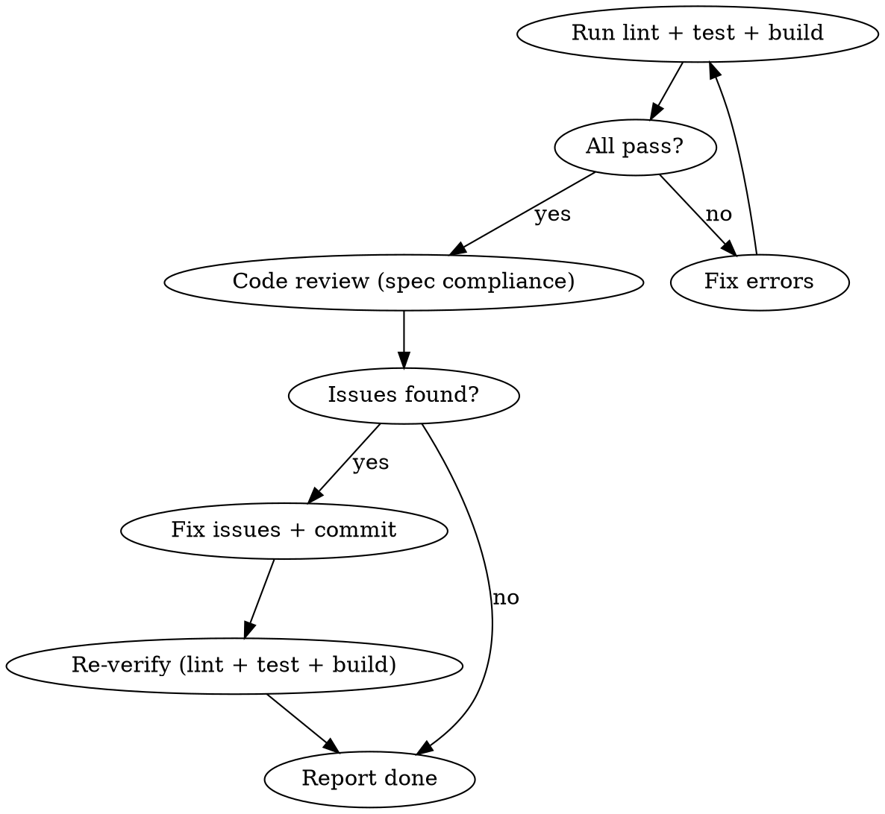

# Feedback Detail Phase

방금 완료한 detail phase의 코드를 검증하고, 문제가 있으면 수정.

## Flow



## Process

### 1. Verify (자동)

```bash
npm run lint && npm test && npm run build
```

실패 시: 에러 분석 → 수정 → 재검증. 최대 3회 시도.

### 2. Code Review (자동)

subagent로 코드 리뷰 실행. 체크 항목:

- **Spec compliance**: plan에 명시된 요구사항이 모두 구현되었는가
- **Type safety**: 빌드 에러 없이 타입 체크 통과하는가
- **Test coverage**: 새 기능에 대한 테스트가 있는가
- **패턴 준수**: 기존 코드베이스 패턴(CLAUDE.md, architecture docs)을 따르는가
- **불필요한 변경**: 요청하지 않은 리팩토링이나 추가 기능이 없는가

### 3. Fix (필요시)

리뷰에서 발견된 문제를 수정:
- 각 수정은 독립 커밋
- 수정 후 다시 lint + test + build 검증
- 수정 불가능한 문제는 사용자에게 보고

### 4. Report

완료 상태 보고:
- 검증 결과 (pass/fail)
- 발견된 문제와 수정 내역
- 다음 detail phase로 진행 가능 여부
