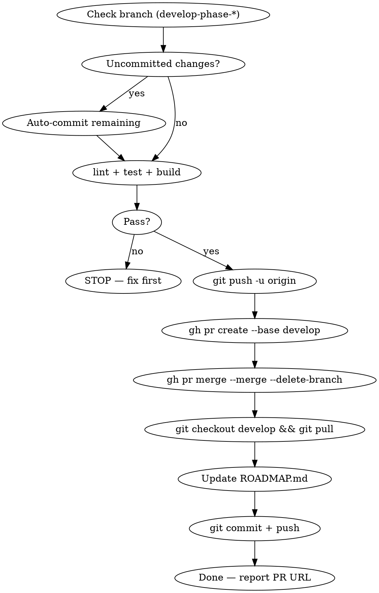

# Land Phase

Phase 완료 후 검증 → PR → 머지 → ROADMAP 갱신을 자동 수행.

## Flow



## Process

### Step 1: Verify

1. 브랜치가 `develop-phase-*`인지 확인. 아니면 중단.
2. uncommitted changes 있으면 자동 커밋 (`chore: final cleanup for phase N`)
3. `npm run lint && npm test && npm run build` — 실패 시 중단, 사용자에게 보고

### Step 2: Push & PR

1. `git push -u origin <branch>`
2. PR body 자동 생성:
   - `git log develop..<branch> --oneline`으로 커밋 목록 추출
   - ROADMAP의 해당 phase 내용 요약
   - Test plan (ROADMAP의 완료 기준 기반)

```bash
gh pr create --base develop --head <branch> \
  --title "feat: Phase N — <phase title>" \
  --body "$(cat <<'EOF'
## Summary
<ROADMAP phase 요약 bullet points>

## Commits
<git log --oneline>

## Test plan
<ROADMAP 완료 기준에서 추출>
EOF
)"
```

### Step 3: Merge

```bash
gh pr merge <number> --merge --delete-branch
git checkout develop && git pull
```

### Step 4: ROADMAP Update

ROADMAP.md에서:
1. 해당 phase 섹션: "다음 ⏭️" → "완료 ✅" 이동, "할 일" → "한 일"
2. 각 세부 항목의 상태를 ✅ 완료로 변경
3. PR 번호 추가 (`**완료 기준**: 충족. **PR #N.**`)
4. 다음 phase를 "다음 ⏭️" 섹션으로 승격
5. 변경 이력 테이블에 날짜 + 요약 행 추가
6. 커밋 + 푸시

```bash
git add docs/ROADMAP.md
git commit -m "docs: mark Phase N complete in ROADMAP"
git push
```

## Error Handling

| 상황 | 대응 |
|------|------|
| develop-phase-* 브랜치 아님 | 중단, 사용자에게 알림 |
| lint/test/build 실패 | 중단, 에러 보고 |
| PR 이미 존재 | 기존 PR 번호 사용 |
| 머지 충돌 | 중단, 사용자에게 알림 |
| stash 필요한 상황 | `git stash` → 머지 → `git stash pop` |
