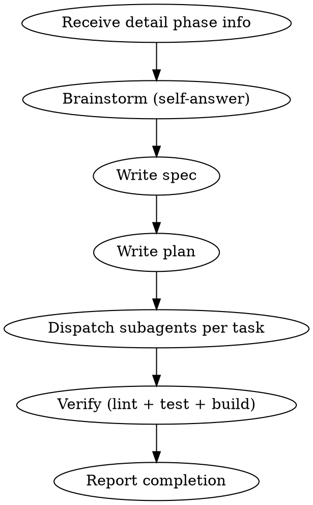

# Next Detail Phase

하나의 detail phase (예: 7-1 키보드 단축키)를 brainstorm → plan → implement 파이프라인으로 실행.

## Input

호출 시 다음 정보가 필요:
- **Phase 번호**: 예) 7-1
- **목표**: 예) 키보드 단축키 추가
- **할 일 목록**: ROADMAP에서 추출한 구체적 작업 항목

`/next-phase`에서 호출할 때 이 정보를 자동 전달. 수동 호출 시 ROADMAP에서 직접 읽음.

## Flow

## Process

### 1. Brainstorm (자체 판단)

- 프로젝트 컨텍스트 파악 (기존 코드, 아키텍처, 패턴)
- 접근 방식 2-3개 비교 후 최적안 선택
- **사용자에게 묻지 않고** Claude가 자체 판단으로 결정
- 단, 중대한 아키텍처 변경이 필요하면 사용자에게 알림

### 2. Spec & Plan

- Design spec 작성 → `docs/superpowers/specs/` 에 저장
- Implementation plan 작성 → `docs/superpowers/plans/` 에 저장
- Self-review 후 바로 진행 (사용자 리뷰 대기 없음)

### 3. Implement

- Plan의 각 task를 subagent로 실행 (subagent-driven-development)
- Task 모델 선택:
  - 단순 작업 (1-2 파일, 명확한 spec): haiku
  - 통합 작업 (여러 파일, 판단 필요): sonnet
  - 아키텍처 결정: opus
- 각 task 완료 후 spec compliance 확인
- 모든 task 완료 후 `npm run lint && npm test && npm run build` 검증

### 4. Commit

- 각 task는 독립 커밋 (subagent가 커밋)
- 커밋 메시지: conventional commits (`feat:`, `fix:`, `test:`, `chore:`)

## Error Handling

- **빌드 실패**: 에러 분석 후 수정, 재검증
- **테스트 실패**: 실패 원인 파악 후 수정
- **subagent 실패**: 더 capable한 모델로 재시도 또는 task 분할
- **3회 실패**: 사용자에게 알리고 중단
