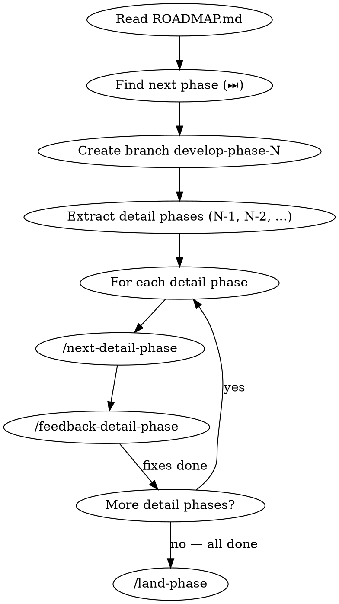

# Next Phase

ROADMAP.md에서 다음 phase를 읽고, detail phase 단위로 자동 실행하는 오케스트레이터.

## Flow

## Process

### Step 1: Read & Plan

1. `docs/ROADMAP.md`를 읽고 "다음 ⏭️" 섹션의 phase를 찾는다
2. Phase의 하위 항목들을 detail phase 목록으로 추출한다 (예: 6-1, 6-2, 6-3, ...)
3. 각 detail phase의 목표와 할 일을 정리한다
4. `develop-phase-N` 브랜치를 생성한다

### Step 2: Detail Phase Loop

각 detail phase에 대해 순서대로:

1. **`/next-detail-phase`** 호출 — brainstorming → plan → 구현
   - 현재 detail phase 번호, 목표, 할 일 목록을 전달
   - 사용자에게 묻지 않고 자체 판단으로 진행 (brainstorming의 질문은 스스로 답변)
2. **`/feedback-detail-phase`** 호출 — 리뷰 + 수정
   - 방금 완료한 detail phase의 코드를 검증
   - 문제 발견 시 수정 후 재검증

### Step 3: Landing

모든 detail phase 완료 후 **`/land-phase`** 호출:
- lint + test + build 검증
- PR 생성 → 머지
- ROADMAP 갱신

## Important

- **사용자 개입 최소화**: brainstorming 질문은 Claude가 자체 판단으로 답변
- **각 detail phase는 독립 커밋**: 하나의 detail phase = 하나 이상의 커밋
- **실패 시 중단**: lint/test/build 실패하면 해당 detail phase에서 멈추고 사용자에게 알림
- **진행 상황 보고**: 각 detail phase 시작/완료 시 간단히 보고
